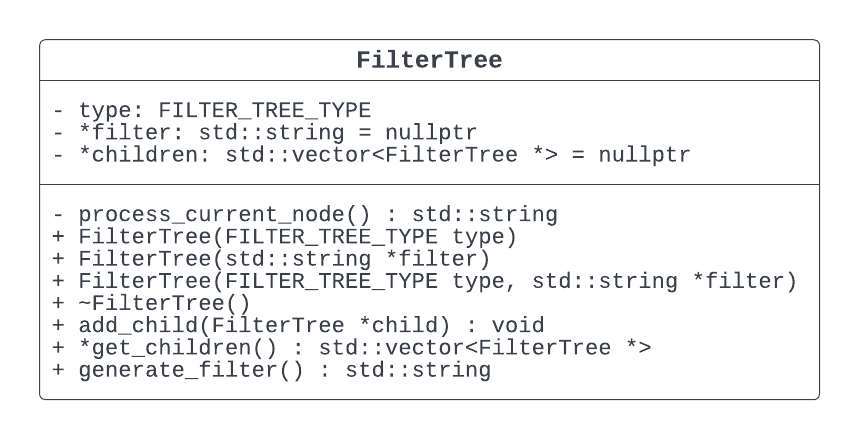
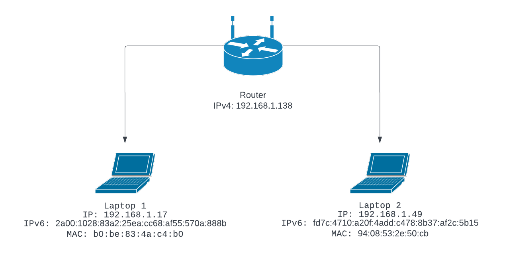
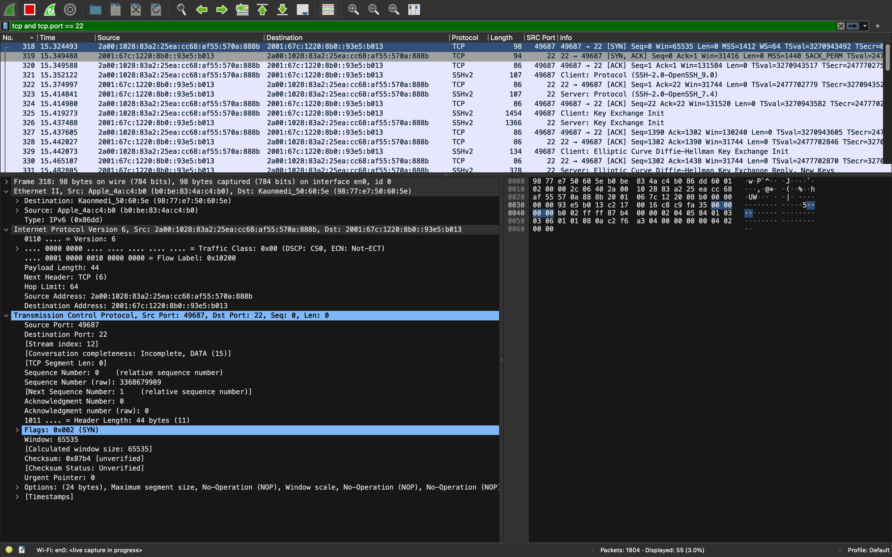

# IPK Project 2 - ZETA: Network sniffer

## Necessary theory

The following theory is necessary to understand the project:

- Ethernet frame
- IP packet
- TCP segment
- UDP datagram
- ICMPv4 packet
- ICMPv6 packet
- ARP packet
- NDP packet
- IGMP packet
- MLD packet
- Tree data structure
- C++20 standard

## Project structure

All source files are located under `src` directory.

All required libraries are located under `lib` directory.

All tests are located under `tests` directory.

All additional documentation files are located under `doc` directory.

## Sniffer flow

Application starts by parsing command line arguments. Arguments are parsed using
`argparse` library. After parsing and validating arguments, the application
initializes the capturing using `pcap` library. Then the application enters
the main loop where it waits for packets. When a packet is captured, the
application processes it and prints it to the standard output. After the
specified number of packets is captured, the application exits.

### Packet filtering



The application uses `pcap_compile` and `pcap_setfilter` functions to filter
packets. The filter is constructed from the command line arguments.

For parsing filters from command line arguments, the application uses
`FilterTree` class. The class is a tree of `FilterTree` nodes. Each node
represents a filter or a group of filters connected by logical operators.
The class provides a method `generate_filter` that generates a string
representation of the filter using tree traversal. The string is then passed
to `pcap_compile` and `pcap_setfilter` functions.

## Building

### Requirements

- pcap library
- C++20 compiler
- make

### Building

```
make
```

### Cleaning

```
make clean
```

## Usage

```
Usage: IPK Sniffer [--help] [--version] [--interface interface] [--tcp] [--udp] [--port port] [--icmp4] [--icmp6] [--arp] [--ndp] [--igmp] [--mld] [-n num]

Optional arguments:
  -h, --help                    shows help message and exits 
  -v, --version                 prints version information and exits 
  -i, --interface interface     Interface to sniff on [default: "-"]
  -t, --tcp                     TCP packets 
  -u, --udp                     UDP packets 
  -p, --port port               Port to sniff on [default: 0]
  --icmp4                       Filter by port 
  --icmp6                       Display only ICMPv6 echo request/response 
  --arp                         Display only ARP frames 
  --ndp                         Display only ICMPv6 NDP packets 
  --igmp                        Display only IGMP packets 
  --mld                         Display only MLD packets 
  -n num                        Number of packets to display [default: 1]

Author: Nikita Moiseev <xmoise01@stud.fit.vutbr.cz>
```

## Testing

### Network topology



Network consists of 1 router and 2 laptops. Each laptop is connected to the
router via Wi-Fi. Router is connected to the internet via Ethernet.

### Testing environment

Laptop 1:

- OS: MacOS Ventura 13.0.1 (22A400)
- IP: 192.168.1.17
- MAC: b0:be:83:4a:c4:b0

Laptop 2:

- OS: Ubuntu 18.04.3 LTS
- IP: 192.168.1.49
- MAC: 94:08:53:2e:50:cb

Router:

- Name: O2 SmartBox

### Testing procedure

The following protocols have been tested:

- TCP
- UDP
- ICMPv4
- ICMPv6
- ARP

The following protocols have been not tested:

- NDP
- IGMP
- MLD

All tests are located under `tests` directory. Each subdirectory is a protocol
that has been tested (except `extra` directory). Each protocol directory has the
following structure:

- `[ii]-[test_name].sh` - script that runs the test
- `[ii]-[test_name].out` - actual output of the test
- `[ii]-[test_name].[n].png` - screenshot from wireshark with the packet
  number `n`

Protocols NDP, IGMP and MLD have not been tested because their capture did not
succeed after several attempts each of 10 minutes.

Each test case was run in the command line manually and the output was saved to
the file. Then the output was compared to the packets captured by wireshark.
The packet information such as source and destination IP addresses, source and
destination MAC addresses and ports. were compared. The data in the packets was
also compared.

Also `tests` folder contains `extra` directory. This directory contains
additional tests: testing the application with invalid arguments, testing
capture on multiple protocols and error handling.

### Example of tests

Test case: `tests/tcp/01-port-specified-1-packet`

Run the test:

```sh
./ipk-sniffer -i en0 --tcp -p 22
```

Actual output:

```
timestamp: 2023-04-17T13:21:51.992+02:00
src MAC: b0:be:83:4a:c4:b0
dst MAC: 98:77:e7:50:60:5e
frame length: 98 bytes
src IP: 2a00:1028:83a2:25ea:cc68:af55:570a:888b
dst IP: 2001:67c:1220:8b0::93e5:b013
src port: 49771
dst port: 22

0x0000: 98 77 e7 50 60 5e b0 be 83 4a c4 b0 86 dd 60 05  .w.P`^...J....`.
0x0010: 01 00 00 2c 06 40 2a 00 10 28 83 a2 25 ea cc 68  ...,.@*..(..%..h
0x0020: af 55 57 0a 88 8b 20 01 06 7c 12 20 08 b0 00 00  .UW... ..|. ....
0x0030: 00 00 93 e5 b0 13 c2 6b 00 16 bb 0e 67 06 00 00  .......k....g...
0x0040: 00 00 b0 02 ff ff 2b 20 00 00 02 04 05 84 01 03  ......+ ........
0x0050: 03 06 01 01 08 0a 56 80 0c a6 00 00 00 00 04 02  ......V.........
0x0060: 00 00                                            ..
```

WireShark screenshot with the packet number:



## Bibliography

- An introduction to libpcap: https://www.tcpdump.org/pcap.html
- libpcap documentation: https://www.tcpdump.org/manpages/pcap.3pcap.html
- pcap-filter man page: https://www.tcpdump.org/manpages/pcap-filter.7.html
- Argument Parser for Modern C++: http://github.com/p-ranav/argparse
- RFC 3339 - Date and Time on the Internet: Timestamps
- IPK lectures: https://moodle.vut.cz/mod/folder/view.php?id=289124